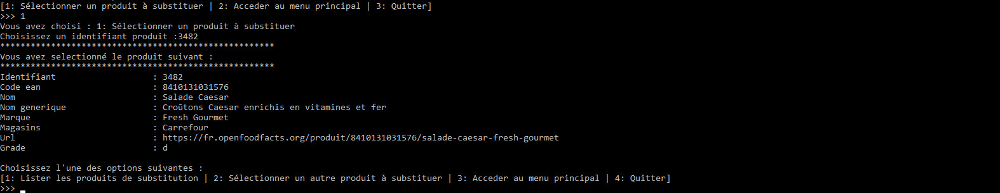
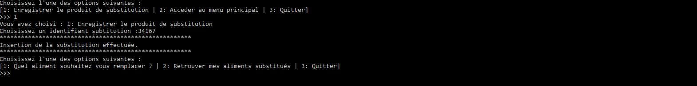
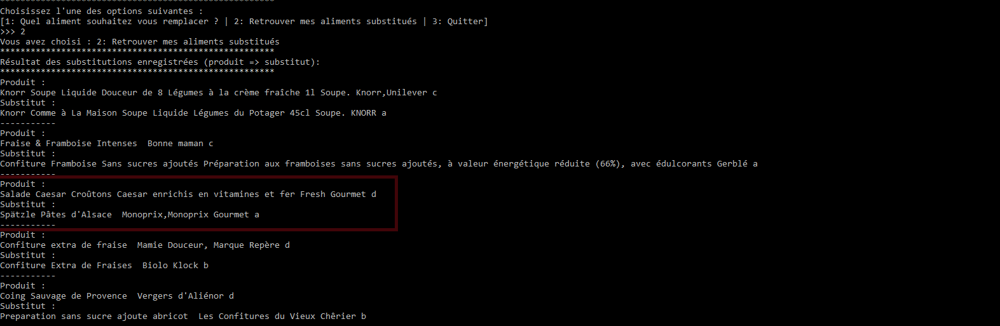
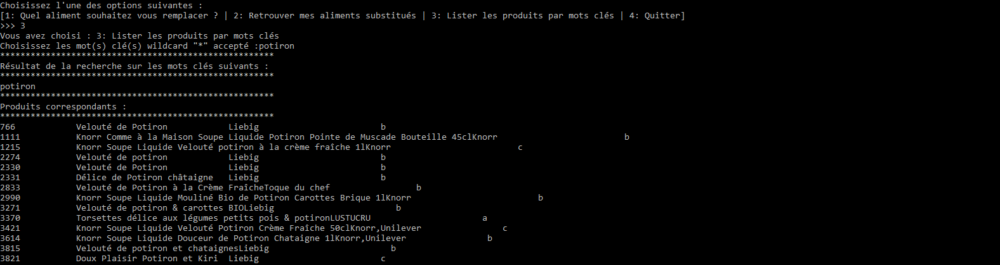

# OpenFoodFacts

status : [](https://app.circleci.com/pipelines/github/jean-charles-gibier/OpenFoodFacts)

## Projet #5 DA Python / OC

Les scripts **pur_beurre.py** et **client_pur_beurre.py** forment une suite interagissant avec la base Open Food Facts pour en récupérer les aliments, les comparer et proposer à l'utilisateur un substitut plus sain à l'aliment qui lui fait envie.

(Les besoins du projet sont [décrits ici](https://openclassrooms.com/fr/projects/157/assignment))

Le programme **pur_beurre.py** présente le fonctionnalités suivantes  :

- requêter sur demandel'API REST Openfastfood
- interperéter la réponse en JSON, déterminer sa nature (OK 200 / KO x00)
- naviguer dans la structure pour en extraire les données utiles
- instancier des objets avec ces données (Categorie, Produit, substitut etc.)
- enregistrer ces objets dans une base de données (en mode raw => par paquet de X000)
- enregistrer les relations entre ces objets
- restituer ces données en fonction de critères choisis (mots clés ou catégorie)
- presenter une suite de services au programme **client_pur_beurre.py** 

Le programme **client_pur_beurre.py**  est une interface exploitant les fonctionalités de **pur_beurre.py**.
Cette interface présente une suite de menus en mode texte. En guise de "user stories", nous définirons les différentes navigation dans l'arborescence des choix.

Sur la plan technique / architecture, ces deux programmes programmes doivent :
- définir un model clair (produit categorie substitut (jointure many 2 many)) 

- respecter la PEP8 /257
- avoir des packages définis (pas de classe "fourre tout")
- découpler Presentation  / Model / View 
- etre "objet "=> limiter le procedural et les "boucles" / listes de compréhension / principe SOLID etc.
- présenter catégorie / produit avec sous classes => une mission par classe : filtrage / nettoyage / enregistrement 

La planification du projet a été organisée sur  le gestionaire [ Jira ](https://jcgibierscompany.atlassian.net/jira/software/projects/CO/boards/2)


# pur beurre
Cours python Openclassrooms 3eme mission

## installation

Prérequis : 
- Serveur mysql installé<br>
(testé sur : Mysql Community Server 8.0.20)
- Accès internet a l'api du site OpenFoodFacts

installer le projet :
````
# git pull <this repo>
````
installer la base et jouer le script init.sql :
````
# cd sql
# mysql -u <username> -p < init.sql
````
modifier la configuration :
````
# cd ../resources
# vim database.json.to_configure
````
modifier les parametres de connexion et sauvegarder sous 'database.json'

lancer/tester
````
# pip install -r requirements.txt
# python3 pur_beurre.py -h
# python3 client_pur_beurre.py 
````


## usage

Le logiciel client se lance sans argument.
````
# python ./client_pur_beurre.py
````

###note:
Le logiciel client interroge le logiciel de requetage **pur_beurre.py**.
Il peut être lancé indépendament avec les paramètres suivants :
````
usage: pur_beurre.py [-h] [-d NBCATEGORY] [-c COUNTRY] [-n NBPRODUCTS]
                     [-gpi GET_PRODUCT_BY_ID] [-gci GET_CATEGORY_BY_ID] [-gcl]
                     [-gplc GET_PRODUCT_LIST_BY_CATEGORY_ID]
                     [-gpsl GET_PRODUCTS_SUBST_LIST]
                     [-gplm GET_PRODUCTS_LIST_BY_MATCH]
                     [-ssp SET_SUBSTITUTE_PRODUCT] [-gsp] [-r]

optional arguments:
  -h, --help            show this help message and exit
  -d NBCATEGORY, --nbcategory NBCATEGORY
                        Maximum categories number
  -c COUNTRY, --country COUNTRY
                        Country where data are selected from
  -n NBPRODUCTS, --nbproducts NBPRODUCTS
                        Maximum products number
  -gpi GET_PRODUCT_BY_ID, --get_product_by_id GET_PRODUCT_BY_ID
                        Get product object by id
  -gci GET_CATEGORY_BY_ID, --get_category_by_id GET_CATEGORY_BY_ID
                        Get category object by id
  -gcl, --get_category_list
                        Get category list
  -gplc GET_PRODUCT_LIST_BY_CATEGORY_ID, --get_product_list_by_category_id GET_PRODUCT_LIST_BY_CATEGORY_ID
                        Get product list by category_id
  -gpsl GET_PRODUCTS_SUBST_LIST, --get_products_subst_list GET_PRODUCTS_SUBST_LIST
                        Get product subsitute list by id
  -gplm GET_PRODUCTS_LIST_BY_MATCH, --get_products_list_by_match GET_PRODUCTS_LIST_BY_MATCH
                        Get product by match on key words between the names of
                        products or categories. Wildcad '*' is allowed.
  -ssp SET_SUBSTITUTE_PRODUCT, --set_substitute_product SET_SUBSTITUTE_PRODUCT
                        Set relation product,substitute by id
  -gsp, --get_recorded_substitutes_product
                        Get recorded substitutes list
  -r, --reload          Reload database from Openfactsfood services
````


# description des fonctionalités

## chargement de la base 


Choisir l'option 1 du menu principal


Le programme charge tout les produits de la base OFF à partir des critères suivants :<br>
Tous les produits appartenant aux categories <françaises> contenant de plus de 10.000 produits <br>
[cf constantes associées au chargement pour toute modification.](https://github.com/jean-charles-gibier/OpenFoodFacts/blob/develop/core/constant.py)

### Affichager les categories
Choisir la catégorie à afficher en selectionnant son identifiant. 


### Afficher les produits liés à une categorie
Sélectionner l'option 1, les produits de la catégorie désirée s'affichent.


### Sélectioner un produit de la catégorie
Sélectionner l'option 1, puis l'identifiant correspondant au produit désiré.


### Afficher la liste des substitutions possibles pour le produit selectionné
Sélectionner l'option 1 pour obtenir les produits substituables<br>
Ces produits sont affichés par ordre de correspondance selon les critères suivants :<br>
- Le nombre de catégories en commun
- le nutriscore le moins élevé
- le score de la fonction "match" mysql sur les champs product, name et marque.


### Enregistrer un produit comme substituable
Sélectionner l'option 1, puis l'identifiant correspondant au produit de substitution


### Lister les produits substitués
Pour vérifier que la substitution est bien enregistrée<br>
Sélectionner l'option 2, pour lister les substitutions


## Recherche des produits par mots clés
La recherche directe de produits par mots clés est une alternative à la recherche par catégories.<br>
A partir du menu principal, selectionner l'option 3 "Lister les produits par mots clés".<br>
Il est possible d'entrer un ou plusieurs mots clés séparés par le caractère 'etoile' <br>
Puis choisir directementun produit à substituer parmi la liste resultante : 


### Afficher le produit substituable

... And son ...
Puis séléctionner l'option 1 'Lister les susbstitutions pour ce produit'<br>
La suite des opération se déroule ensuite comme avec le choix par catégories. 


# MCD

